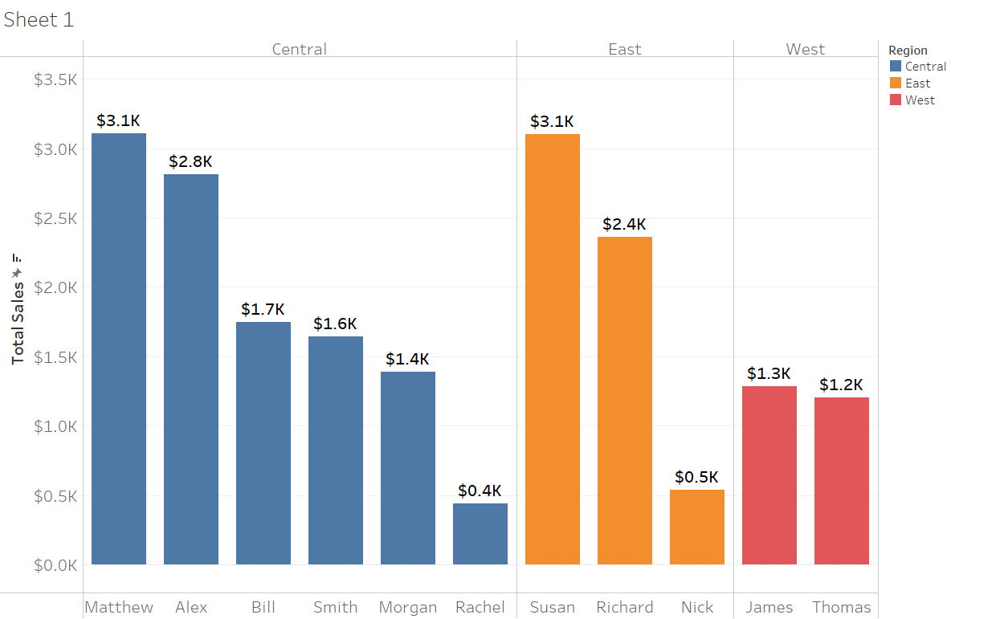
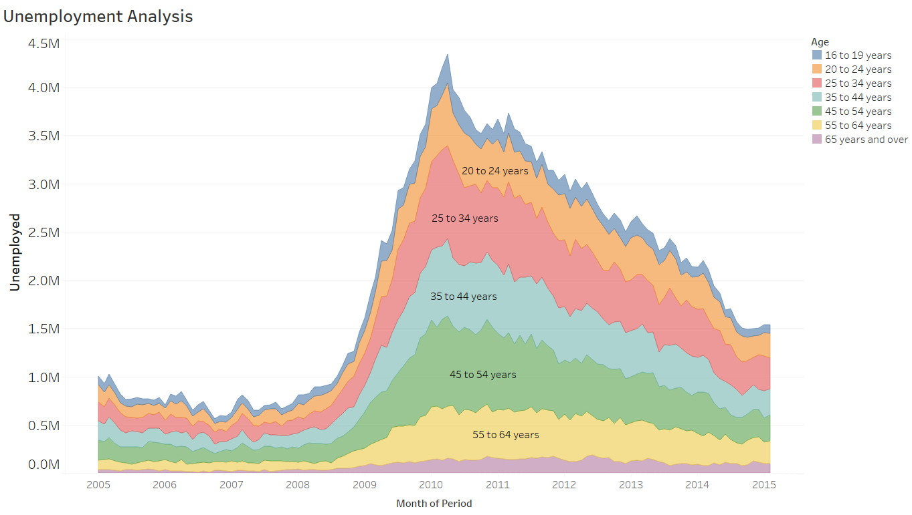
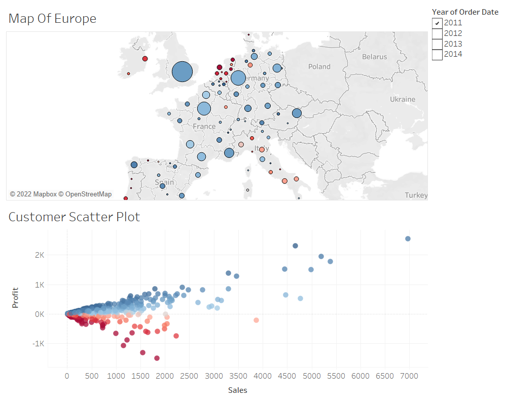
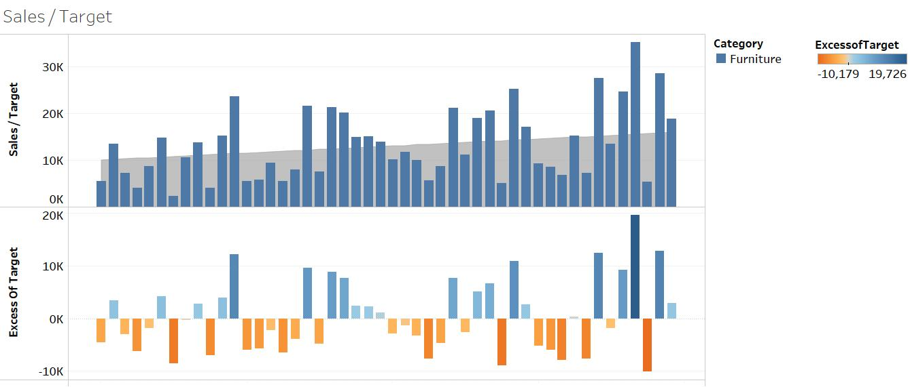
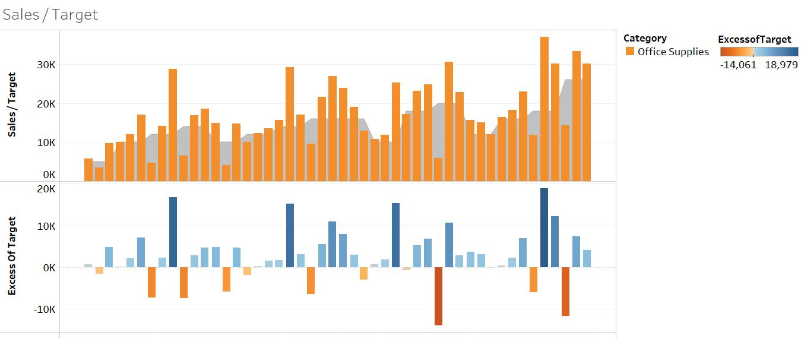
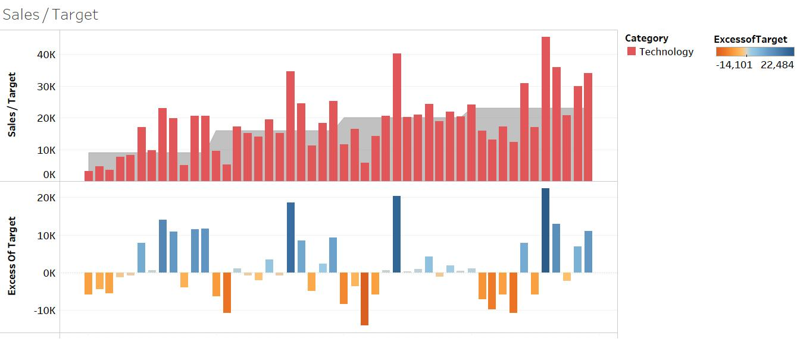
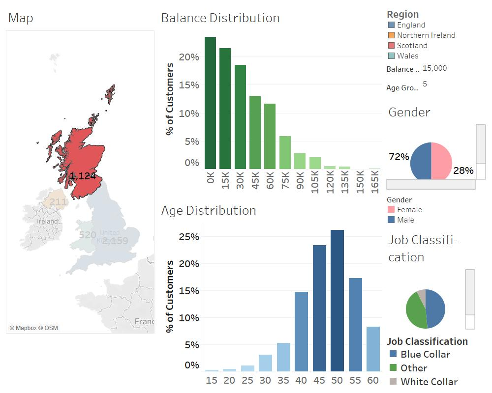

# Tableau-2020-A-Z-Hands-On-Tableau-Training-for-Data-Science
This Repo will contain all my work and visualizations done through out this course.

## Topics learnt from the Course:

* Download and installation of Tableau Desktop
* Connect Tableau to different data sources
* Create different types of charts such as : Bar, Area, and Pie Charts
* Create Scatter plots, Treemaps, and Maps
* Create calculated fields, table calculations, and parameters
* Different types of Joins and Data Blending
* Dashboards and Storytelling
* Data Preparation
* Clusters and Custom Territories, and Design Features

## Some Visualizations done through the Course:

## Appendix:

[Course Link](https://www.udemy.com/course/tableau10/)
